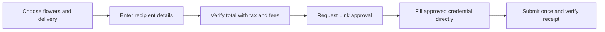

# Prepare a flower delivery with Stagehand

Prepare a 1-800-Flowers.com delivery cart with Stagehand on Browserbase. This is the browser portion of an agent that can request payment through Link SDK once it has a complete order quote.

The current runnable flow prepares the cart and reaches the recipient form. It chooses a small Floral Embrace bouquet, the next available delivery date, and a complimentary gift message. It does not create a Link spend request or place an order. The payment adapter remains in progress until the recipient details and the final checkout are verified.

The browser code uses `act()` to navigate and select options, `extract()` to read order details, and `observe()` to discover the current date, checkout button, and input fields. It replays observed actions to fill application-provided values. Merchant-specific CSS selectors are not part of the flow.

## Run the cart preparation

Use Node.js 22.18 or newer and supply `BROWSERBASE_API_KEY` through your secret manager.

```bash
git clone https://github.com/browserbase/integrations.git
cd integrations/examples/integrations/stripe/link-sdk
npm install
cp flowers.example.json flowers.json
npm run flowers
```

`flowers.json` selects the product, size, delivery ZIP, and item budget. The example uses `94107`, the `America/Los_Angeles` delivery time zone, and `next_available`. The script gives the calendar extraction the current date, then checks that the cart matches the date it selected. Set the delivery time zone to match the destination if you change the ZIP. A same-day or weekend date can carry an extra delivery fee. The script uses a fresh Browserbase session, skips optional gifts and email signup, selects the complimentary greeting message, and closes the browser when it finishes.

With `recipient: null`, it stops at the delivery form and returns `DELIVERY_DETAILS_REQUIRED`. The item price is not a final payment total: the merchant still shows tax and service fees as `TBD`.

To continue delivery preparation, supply `recipient` in your ignored local configuration:

```json
{
  "firstName": "Recipient first name",
  "lastName": "Recipient last name",
  "address1": "Recipient street address",
  "address2": "",
  "city": "San Francisco",
  "state": "CA",
  "postalCode": "94107",
  "phone": "4155550100"
}
```

Replace these placeholders with the intended recipient's details. Keep personal details out of source control. The delivery submission path still needs verification with a complete recipient address.

## Where Link fits



The approval amount must come from the completed checkout, including delivery, service fees, and tax. An “Order Total” displayed while any required component is `TBD` is not ready for approval.

Once the complete order is verified, the application can use Link SDK's `spendRequests.create()` and `requestApproval()` calls, wait for `approved`, and retrieve the credential for direct field filling. The adapter must verify the merchant's receipt after submission. That payment step has not yet run on 1-800-Flowers.

1-800-Flowers is a live merchant. Link test credentials do not turn its checkout into a sandbox. A full payment test requires an intended flower delivery and a new, matching Link approval. Do not reuse a credential approved for another merchant or amount.
